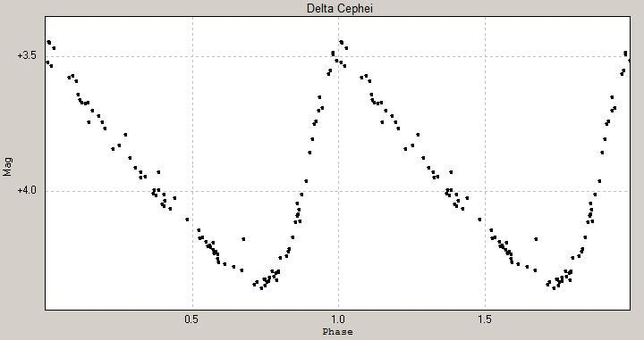
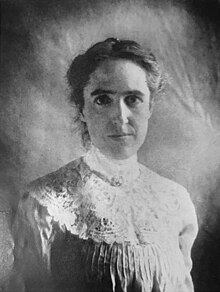

# 🌟 Estrelas Cefeidas: Explorando o Universo 🌌

As **estrelas cefeidas** são um dos marcos da astronomia moderna! Estas estrelas variáveis pulsantes desempenham um papel essencial na medição de distâncias no cosmos, ajudando a revelar a verdadeira escala do universo. ✨

## 🔍 O Que São as Estrelas Cefeidas?

As cefeidas são estrelas cuja **luminosidade varia periodicamente**, mudando de brilho em ciclos regulares que vão de 1 a 100 dias. Essa variação ocorre devido a mudanças físicas internas na estrela, que expandem e contraem sua camada externa. 

**Acima**: Exemplo de uma curva de luz de uma cefeida, mostrando as mudanças de brilho ao longo do tempo.

## 🌟 Relação Período-Luminosidade

Descoberta em 1912 pela astrônoma **Henrietta Swan Leavitt**, a relação período-luminosidade é a chave para o uso das cefeidas como ferramentas de medição no universo. Ela mostrou que:

- Quanto maior o **período** (tempo de oscilação do brilho), maior a **luminosidade intrínseca** da estrela. 🔭✨
- Isso permite determinar distâncias até galáxias muito distantes, algo que revolucionou a astronomia!

---

## 🪐 Relevância Astronômica

As cefeidas são as verdadeiras **velas-padrão** da astronomia, usadas para medir distâncias em grandes escalas. 🌠 Elas foram cruciais em várias descobertas:

1. **Tamanho do Universo** 🌌  
   Através das cefeidas, **Edwin Hubble** determinou que existem galáxias além da Via Láctea, revelando que o universo é muito maior do que imaginávamos.

2. **Expansão do Universo** 🚀  
   Usando cefeidas, Hubble mostrou que o universo está se expandindo, desenvolvendo a famosa **Lei de Hubble-Lemaître**.

---

## 🏆 Henrietta Swan Leavitt e o Prêmio Nobel

🔬 Henrietta Swan Leavitt, enquanto trabalhava no Observatório de Harvard, fez a descoberta essencial da relação período-luminosidade. Seu trabalho foi tão importante que, em 1924, ela foi considerada para o **Prêmio Nobel**. Infelizmente, a indicação foi inviabilizada por sua morte precoce, já que o Nobel não é concedido postumamente. 🕊️

---

## 🎨 Curiosidades e Destaques

- O nome "cefeidas" vem da estrela **Delta Cephei**, localizada na constelação de **Cefeu**. ✨
- As cefeidas ajudam a calibrar outras técnicas modernas, como a medição de distâncias por supernovas tipo Ia.

---

## 🌌 Galeria de Imagens

### Henrietta Swan Leavitt: A Pioneira das Cefeidas  

### A Galáxia de Andrômeda, onde cefeidas foram usadas para medições  

---

